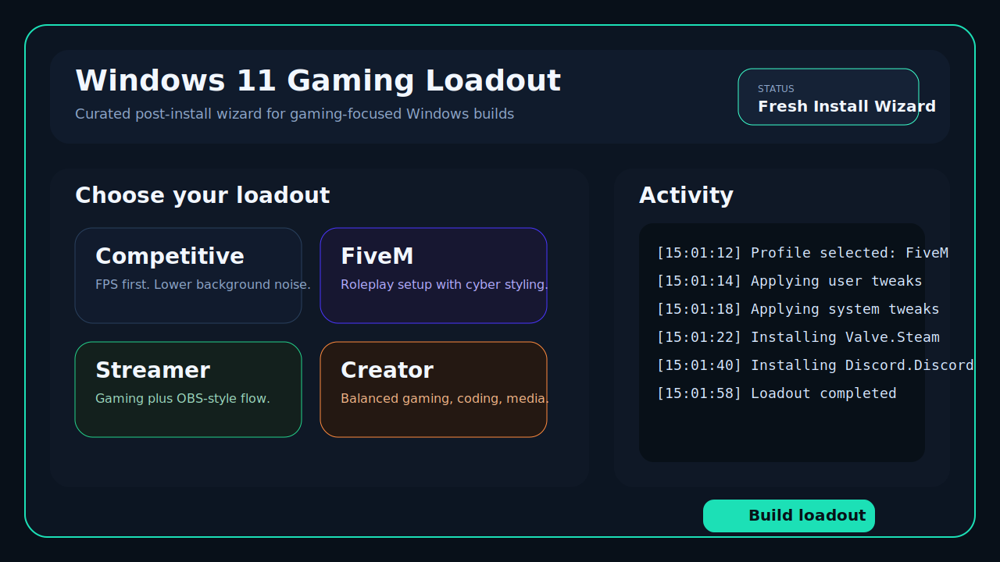

# Win11 Gaming Loadout

Win11 Gaming Loadout is a curated Windows 11 ISO builder for gaming-focused installs.

It takes a clean Windows 11 ISO, removes some bundled noise, applies safer gaming-friendly defaults, and injects a first-login GUI wizard inspired by the "system loadout" idea.



## What it is

- A local Windows 11 ISO customization workflow
- A safer alternative to ultra-stripped builds
- A first-login WPF wizard with curated profiles
- Optional Rainmeter desktop modules for selected profiles
- Local account creation through generated unattended setup
- More aggressive OOBE suppression to reduce Microsoft account prompts and setup noise
- First-logon handoff driven by unattended setup, with SetupComplete fallback
- Custom WinPE launcher that starts before the stock Windows setup UI
- A gaming-focused setup flow for fresh installs

## What it is not

- Not an activation bypass
- Not a TPM or Secure Boot bypass
- Not a "remove everything" image
- Not a promise of lower latency through unsafe tweaks

## Current profiles

- `Competitive`: cleaner desktop, lower background noise, FPS-first defaults
- `FiveM`: roleplay-friendly setup with a cyber look, core gaming apps, and an optional Rainmeter module
- `Streamer`: gaming plus OBS-style creator flow with an optional Rainmeter module
- `Creator`: balanced gaming, coding, media setup, and an optional Rainmeter module

## Included flow

1. Copy the ISO contents into a writable workspace
2. Mount `boot.wim` and inject a custom WinPE launcher
3. Mount `install.wim`
4. Remove selected provisioned apps
5. Apply offline registry tweaks
6. Inject `SetupComplete.cmd`
7. Inject the first-login GUI wizard
8. Write `autounattend.xml`
9. Build a new ISO if `oscdimg.exe` is available

## Safety goals

- Keep Windows Update
- Keep Microsoft Store
- Keep Defender
- Avoid extreme component removal
- Keep the project understandable and editable

## Requirements

- PowerShell running as administrator
- `DISM` available on the host machine
- `oscdimg.exe` if you want a final bootable ISO from the script

## Quick start

```powershell
Set-ExecutionPolicy -Scope Process Bypass
cd "C:\Users\Patri\Desktop\win11-gaming-build"
.\Build-GamingISO.ps1 -IsoPath "C:\Users\Patri\Downloads\Win11_25H2_Norwegian_x64_v2.iso"
```

The first run lists available Windows editions. Then run it again with the edition index you want:

```powershell
.\Build-GamingISO.ps1 -IsoPath "C:\Users\Patri\Downloads\Win11_25H2_Norwegian_x64_v2.iso" -EditionIndex 6
```

## Output

- ISO tree: `output\iso-root`
- Final ISO: `output\Win11-GamingLab.iso` when `oscdimg.exe` is present

## Repo layout

- `Build-GamingISO.ps1`: main builder
- `payload/SetupComplete.cmd`: post-setup launcher
- `payload/FirstLogon.ps1`: WPF loadout wizard
- `payload/RainmeterProfiles/*`: optional desktop skins per profile
- `docs/preview.svg`: visual repo preview
- `CHANGELOG.md`: release history
- `releases/RELEASE_TEMPLATE.md`: release notes template

## Release flow

1. Make changes
2. Test the builder on a clean ISO
3. Update `CHANGELOG.md`
4. Tag a release
5. Publish release notes using `releases/RELEASE_TEMPLATE.md`

## Notes

The GUI wizard uses built-in PowerShell and WPF so it stays portable on stock Windows installs.

This project intentionally favors maintainability over aggressive stripping.
